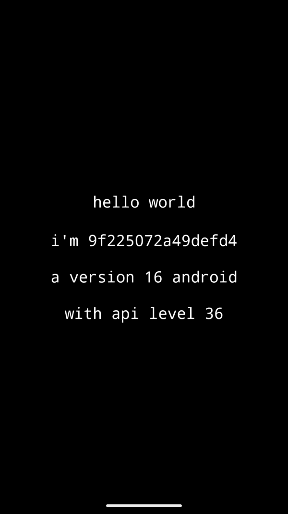
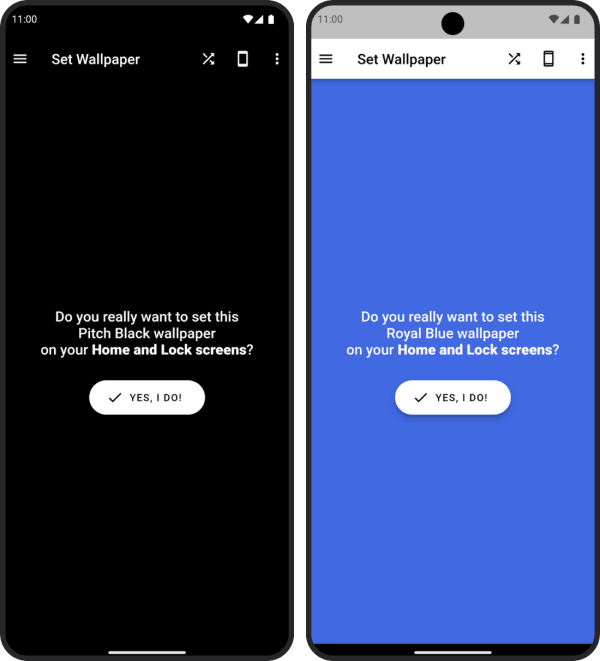

# Hello World Self-Aware

This is a small 121 KB Hello World app that lets the Android device introduce itself by "name" (serial number), Android version and API Level.
 
[Hello World apps](https://en.wikipedia.org/wiki/%22Hello,_World!%22_program) are usually not supposed to be useful. However, you may use this tiny app to quickly find out the Android version and API Level of a device; all displayed information can be copied to the clipboard with a simple long-press. Because it's so tiny and doesn't need any permissions, it's very easy to install even on older and less powerful hardware.

## Screenshot

## Download

You can download the latest version from the [GitHub Releases](https://github.com/Appliberated/HelloWorldSelfAware/releases/latest) page. This app is not available on the Google Play Store. You will download an `.apk` file that can be installed directly on your Android device.

## Building from Source

If you'd like to build the app yourself:

1.  Clone the repository: `git clone https://github.com/Appliberated/HelloWorldSelfAware.git`

2.  Open the project in Android Studio.

3.  Let Gradle sync the project.

4.  Click `Run 'app'`.

The project is configured to work with a minimum API level of 9 (Android 2.3 Gingerbread).

## Technical Notes

This project is intentionally kept simple as a learning example. It is written in [Java](app/src/main/java/com/appliberated/helloworldselfaware/MainActivity.java) and uses the classic, plain Android SDK (`android.app.Activity`, `android.widget.TextView`, etc.) without any modern `androidx` libraries or Jetpack Compose. In fact, the `dependencies` section in the [build file](app/build.gradle.kts) is empty.

This direct-to-the-SDK approach is the main reason the final `.apk` is only 121 KB. While this is not the recommended architecture for complex, modern applications, it serves as a clear example of a minimal, dependency-free Android app. The original code was written in 2017 and has been maintained to run on the latest Android versions while preserving this original, lightweight approach.

## Contributing

Thank you for contributing! Hello World Self-Aware is designed to be as simple as possible, but you can still help with:

* testing and reporting bugs
* creating a nice Android app icon to replace the [current one](app/src/main/res/mipmap-xxxhdpi/ic_launcher.png)

## Support my work

Hello World Self-Aware is a free app, and I enjoy creating and sharing learning projects like this, along with other useful [free apps](https://www.appliberated.com/). If you'd like to support my work, consider checking out the following Pro applications:

[Pitch Black Wallpaper Pro](https://www.tecdrop.com/pitchblackwallpaperpro/) | [RGB Color Wallpaper Pro](https://www.tecdrop.com/rgbcolorwallpaperpro/) |
| :--- | :--- |
| <li>Pitch black & dark wallpapers</li><li>AI-generated wallpapers</li><li>Enhances battery life</li><li>Reduces eyestrain</li> | <li>Set any color as wallpaper</li><li>Endless color options, built-in & custom</li><li>Reduce visual clutter</li><li>Enhanced device aesthetics</li> |

## License

Hello World Self-Aware is released under the [MIT License](LICENSE).
